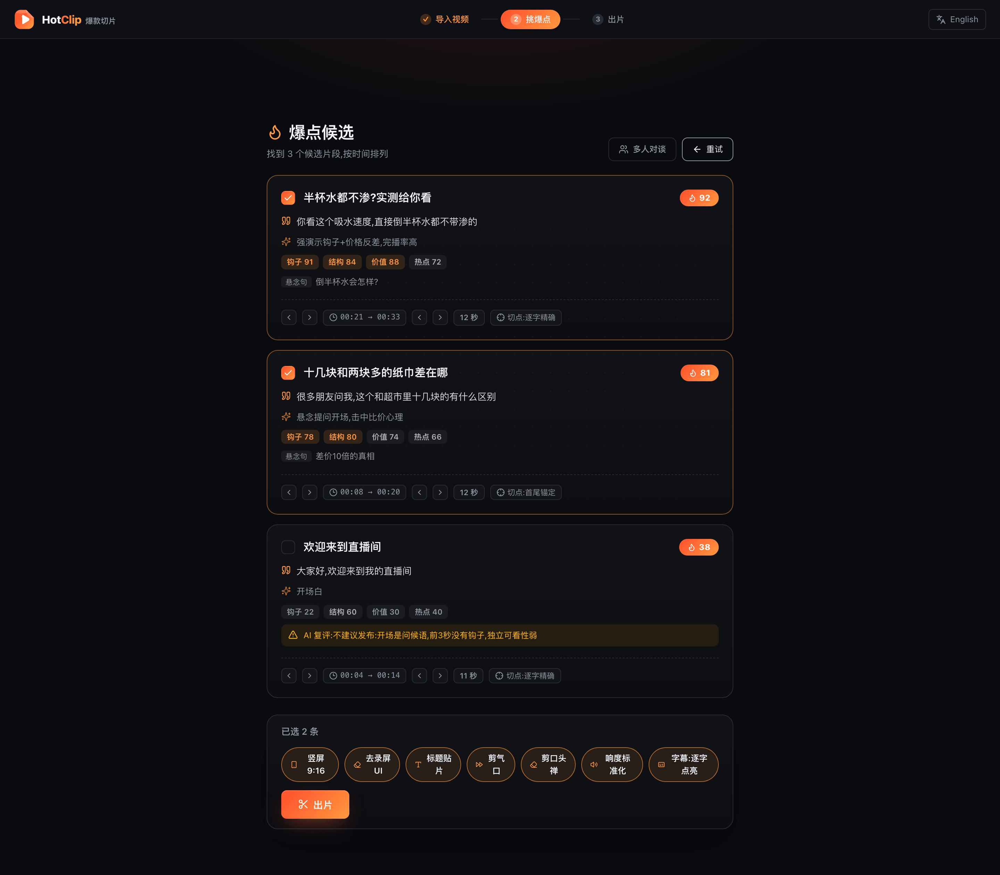
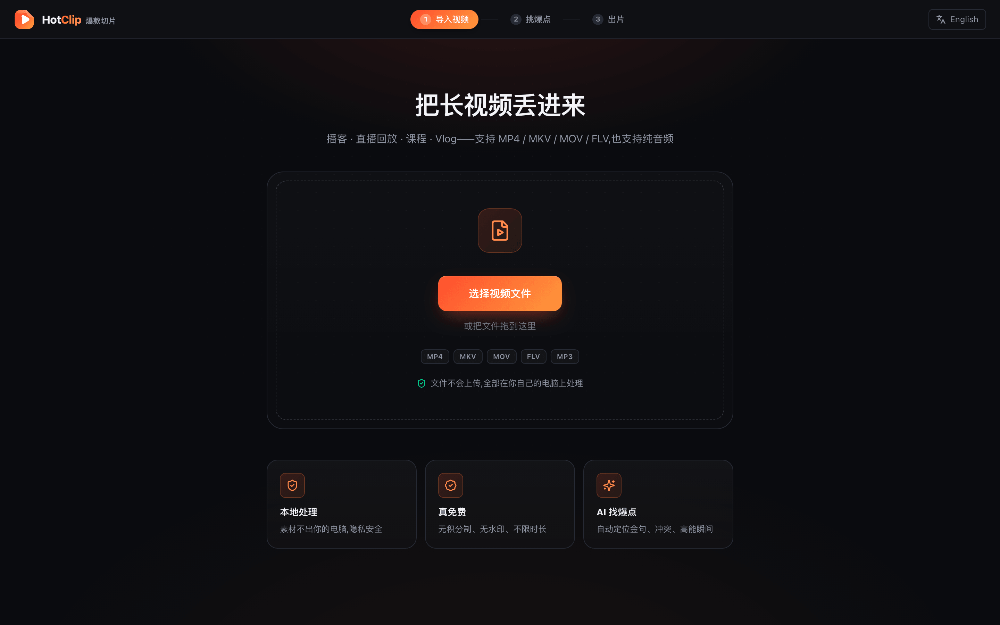
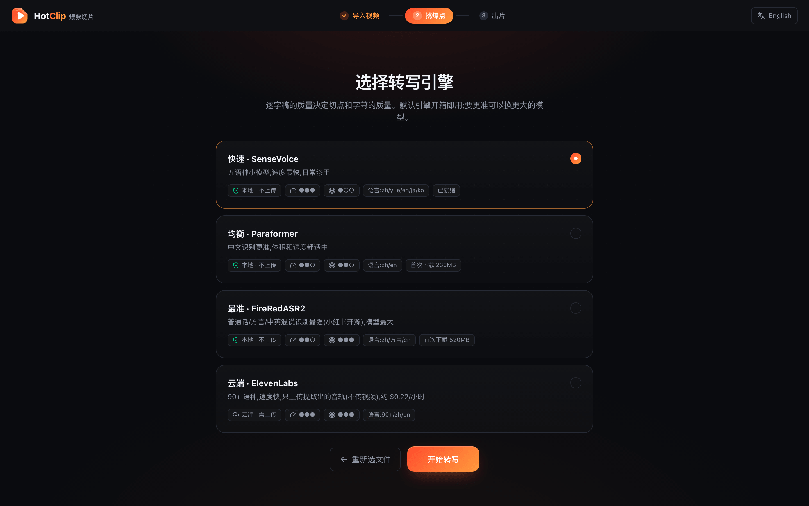
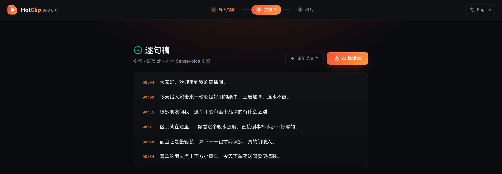
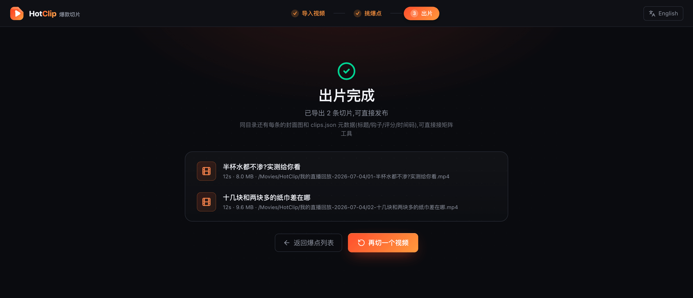

# HotClip 爆款切片 — 长视频/直播回放,一键切出爆款竖屏短视频 | AI Clip Generator: Long Video to Viral Shorts

> **把几个小时的长视频,筛成能上热门的短视频。** 播客 · 直播回放 · 课程 · Vlog → AI 自动找爆点(金句/冲突/高能瞬间) → 竖屏 9:16 重构 + 逐字动态字幕 → 直接发**抖音 / 快手 / B站 / 视频号 / 小红书 / TikTok / Reels / Shorts**。
>
> **无积分制 · 无水印 · 不上传 · 不限时长——因为它就跑在你自己的电脑上。** 提供 Windows / macOS 桌面客户端,不会代码也能用。AI 负责找爆点,最终哪条能发、切在哪里,由你定夺。

> **Pan hours of long-form video for gold.** Podcasts · livestream replays · lectures · vlogs → AI highlight detection (quotables, conflict, peak moments) → 9:16 auto-reframe + word-level animated captions → ready to post on TikTok / Reels / Shorts / Douyin / Bilibili.
>
> **No credits, no watermark, no uploads, no length caps — it runs on your machine.** Ships as a beginner-friendly Windows / macOS desktop app. Human-in-the-loop by design: AI nominates the highlights with evidence, you make the call.

<p align="right"><strong>中文</strong> · English (bilingual README)</p>

---

## 界面预览 / Screenshots

<p align="center">
  
</p>
<p align="center"><sub><b>AI 通读全文挑爆点</b> —— 每条候选附爆款分、钩子、四维分项(钩子 / 结构 / 价值 / 热点)、悬念句与逐字精确切点;弱片自动标「不建议发布」,勾选取舍全在你手。<br/><i>AI reads the whole transcript and nominates highlights — each with a virality score, hook, four-dimension breakdown, a teaser line, and word-accurate cut points; weak picks are auto-flagged, you make the call.</i></sub></p>

<table>
  <tr>
    <td width="50%"><br/><sub>① <b>导入</b> 播客 / 直播回放 / 课程 —— 全程本地处理,素材不上传</sub></td>
    <td width="50%"><br/><sub>② <b>选转写引擎</b> —— 三档本地(SenseVoice / Paraformer / FireRedASR2)+ 可选云端,隐私分级明标</sub></td>
  </tr>
  <tr>
    <td width="50%"><br/><sub>③ <b>逐字转写</b> —— 带时间戳的逐句稿,是找爆点和字幕的地基</sub></td>
    <td width="50%"><br/><sub>④ <b>一键出片</b> —— 竖屏成片直接发,附封面图与 clips.json 元数据</sub></td>
  </tr>
</table>

> 截图为真实界面(演示素材:一段带货直播回放)。The screenshots above are the real UI, driven with a sample livestream-selling replay.

---

## 🚧 项目状态 / Status

**v0.4.3 已发布**——「导入 → AI 找爆点 → 竖屏+逐字字幕成片」三步全流程可下载可用,并已长出**说话人分离、气泡特效字幕、气口跳剪、一键全托管**等能力,[去下载](https://github.com/xixihhhh/hotclip/releases/latest):

| 里程碑 Milestone | 状态 Status |
|---|---|
| 桌面客户端(Electron,中英双语,导入+媒体探测) | ✅ 已完成 |
| 本地转写(SenseVoice / Paraformer / FireRedASR2 三档 + 云端 ElevenLabs,逐字时间戳,首启自动下载·国内镜像优先) | ✅ 已完成 |
| AI 找爆点(LLM 只引原文不猜时间戳,逐字反向对齐 → 切点精确到词,四维复评打分) | ✅ 已完成 |
| 出片(帧精确切割 + 竖屏 9:16 重构 + 卡拉OK逐字字幕烧录) | ✅ 已完成 |
| 人脸跟随智能取景(镜头级三模式,无人脸自动回退居中裁剪) | ✅ 已完成 |
| 说话人分离 · 气泡特效字幕 · 气口跳剪 · 剪口头禅 · 响度标准化 · 转写缓存 · 一键全托管 | ✅ 已完成 |
| 安装包发布(Windows exe + 绿色版 zip + macOS dmg) | ✅ [v0.4.3 已发布](https://github.com/xixihhhh/hotclip/releases/latest) |
| 平台规格预设 · 剪映草稿导出 · Web 平台版 · 更多界面语言 | 🗺️ 规划中 |

## 三步出片 / How It Works

1. **导入**:把播客、直播回放、课程、Vlog 丢进来(MP4 / MKV / MOV / FLV / TS,也支持纯音频)
2. **挑爆点**:本地逐字转写 → AI 通读全文挑出金句/冲突/高能片段,每条附爆款分、开场钩子和推荐理由,切点精确到词;看不顺眼的取消勾选即可
3. **出片**:一键切出竖屏 9:16 成片,卡拉OK逐字点亮字幕直接烧进画面,文件落在「影片/HotClip」里,打开就能发

## 为什么做 HotClip / Why

市面上的 AI 切片工具,要么**按分钟扣积分**(一期 2 小时播客烧光整月额度),要么**必须上传云端**(未发布的素材/客户内容不敢传),要么切点稀烂(句子切一半、没上下文),要么**中文支持名不副实**。开源侧则几乎全是命令行/自部署,小白装不起来。

HotClip 的答案:

- 🖥️ **双击就能用**:Windows / macOS 安装包,不用 Python、不用 Docker、不用命令行
- 🔒 **本地优先**:转写、找爆点、切片全在你电脑上跑,素材不上传
- 🆓 **真免费**:开源 AGPL-3.0,无积分制、无水印、不限视频时长
- 🎯 **切点准**:LLM 只负责«挑哪段»,时间戳由逐字转写反向对齐——不让 AI 猜时间
- 🇨🇳 **中文原生**:中文语音识别走专门引擎(SenseVoice,兼顾粤语),界面中英双语,爆点判断的提示词也按内容语言分流——不是英文产品硬翻
- 🤖 **模型自带干粮也行**:默认本地免费模型;要更强的爆点判断,可一键接 [Atlas Cloud](https://www.atlascloud.ai)(一个 Key 用齐中外主流大模型)、fal.ai 或任意 OpenAI 兼容接口

Every commercial clipper meters your source minutes, forces cloud uploads, or botches clip boundaries; every open-source one is CLI/Docker-only. HotClip is the missing piece: an installable, local-first, bilingual desktop clipper with accurate text-aligned cuts — bring your own AI provider (Atlas Cloud recommended, fal.ai and any OpenAI-compatible endpoint supported).

## 对比 / How it compares

| | HotClip | OpusClip / Klap / Vizard 等 SaaS | 剪映/CapCut 智能切片 | FunClip / autoclip 等开源 |
|---|---|---|---|---|
| 价格 | **免费开源** | $29+/月,按源视频分钟扣积分,重生成再扣,退订积分作废 | 核心功能进会员/Pro | 免费 |
| 素材去向 | **全程本地,不上传** | 必须上传云端 | 云端处理为主 | 本地 |
| 水印/时长限制 | **无** | 免费档有水印、限时长 | 部分模板有限制 | 无 |
| 小白可用 | **双击安装即用** | 网页版,易用 | 易用 | 命令行/Docker/自部署 |
| 切点质量 | **逐字对齐,精确到词,附理由可否决** | 黑盒打分,常被抱怨断章取义 | 黑盒 | 按句切,无爆点排序 |
| 竖屏字幕 | **9:16 重构 + 逐字点亮字幕内置** | 有(付费档) | 自动字幕已进付费 | 多数无竖屏重构 |

> 一句话:SaaS 的积分制和黑盒是最大怨气来源;开源工具装不起来。HotClip 把两边的坑同时填上。

## 已实现 / Shipped

- **本地逐字转写(三档可选)**:快速 SenseVoice(五语种,170MB)/ 均衡 Paraformer(中文更准,230MB)/ 最准 FireRedASR2(普通话/方言/中英混说,小红书开源,520MB)——全部本地运行、逐字时间戳、首次自动下载(国内镜像优先),模型不带标点的档位自动用标点模型回补;另有**云端档 ElevenLabs**(自带 Key,90+ 语种,只上传提取的音轨、绝不上传视频)
- **AI 找爆点**:LLM 只负责«挑哪段»并引用原文,时间戳由逐字转写反向对齐(逐字精确/首尾锚定/按句对齐三级降级,UI 明示切点质量)——不让 AI 猜时间
- **证据链卡片**:每条候选附爆款分、开场钩子、推荐理由、精确时间边界,可勾选取舍
- **人脸跟随智能取景**:竖屏 9:16 重构自动检测并跟随人脸(镜头级三模式:静止不动/平滑横移/One Euro 跟踪),人不在画面中间也不切歪;无人脸自动回退居中裁剪
- **卡拉OK逐字字幕**:词级时间戳驱动的逐字点亮字幕(ASS/libass),直接烧录进成片,可开关
- **语义断行(免 Key)**:字幕不再按固定字数「拦腰截断」——顺着 ASR 标点模型标出的逗号/顿号在真实子句处换行,长句里没有标点时再回看到最近的结构助词(的/了/着…)断,「十几块的 / 到底有什么区别」这样短语保持完整;等价于头部项目用 LLM 插 `[br]` 的效果,但用本地信号、零额外调用、不需要云 Key
- **气泡特效字幕(Web 渲染引擎)**:用应用内置的 Chromium 离屏逐帧渲染 CSS 字幕层再合成进片——自适应圆角气泡底、关键词渐变金字、弹性入场,这些传统字幕烧录(libass)做不出的效果,一档切换即得;确定性逐帧驱动,同输入必出同片
- **标题贴片**:AI 起的爆款标题自动烧进顶部安全区(黑底白字贴片),切片标配一步到位
- **AI 复评质量门**:严格评审员二次盲评每条候选,**钩子/结构/价值/热点四维分项打分**,每维一句话理由,另给一条可印上视频开头的悬念句;弱候选透明标记默认不选——托管出的每条都过双重关
- **爆款分=排名不是玄学**:总分由四维加权后按候选间相对排名归一(推荐档 76-99),同一批次内可直接比大小,不受 AI 打分批间漂移影响——商业工具同款做法,诚实标注它是排序器不是播放量预言
- **多人对谈「谁在说话」**:一键开启说话人分离(本地 pyannote+3D-Speaker,零上传),逐句标注谁在说——AI 按说话人挑段、避免把两个人的半句拼成断章取义,气泡字幕还能按人上色;访谈/播客/连麦场景专治「切出来不知道谁说的」
- **去录屏UI**:手机直播录屏的状态栏/固定UI/上下黑边,用时域方差自动检测并裁除(静止的是UI,会动的是内容),检测不到就不裁
- **气口跳剪**:自动剪掉说话间的停顿静音并拼接,字幕时间轴同步重映射——成片节奏像人剪的,不是机切;剪不剪由「无词 **且** 声学静默」双重判定,笑声、掌声、BGM 高潮这些没有台词但有情绪的瞬间不会被误删
- **剪口头禅**:嗯/呃 等语气词和结巴重复自动剪除(词表刻意保守,「然后/那个/句尾的啊」这类真词不动);剪了什么逐条列进 clips.json,你始终知道 AI 动了哪里
- **响度标准化**:每条切片按 EBU R128 归一到 **-14 LUFS 社媒标准**(抖音/TikTok/Reels/视频号 播放同款响度),整批出片音量一致、不再有的太小声有的爆音——平台不会因忽大忽小压流量,观众也不用一直调音量;跳剪拼接后的成片按拼接后的音轨算响度,不是分段各算
- **封面图 + 元数据导出**:每条切片附带封面 JPG(带字幕和标题贴片,平台直传)和 clips.json(标题/钩子/评分/评审意见/时间码/关键词),矩阵运营直接接 CMS;还带**处理产出回执**(有效字幕样式、取景是 face-track 还是回退中心裁、跳剪剪除比与拼接段数、剪了几个口头禅)——AI 到底对每条片子做了什么,一目了然可审计
- **画面声音证据**:响度峰值与镜头切换密度本地采集,注入爆点判断——不再纯文本盲选
- **转写结果本地缓存**:转写是整条流水线最慢的一步;结果按(文件+引擎)缓存在本地,同一个文件下次再开、想换设置多切几条,**跳过重转写秒进挑爆点**(云引擎还顺带省一次 API 费),文件改动或换引擎自动失效
- **一键全托管**:导入后点一个按钮,转写 → 找爆点 → 竖屏+字幕+剪气口成片全自动跑完,人只做最后审片
- **帧精确切割**:快速定位 + 重编码,爆点第一秒不糊不偏;直播回放数小时 FLV/TS 直接进
- **中英双语界面**,新增语言只需一个语言文件

## 规划中 / Planned

- **字幕样式预设**:大字关键词 / 极简白字等多套模板
- **平台规格预设与剪映草稿导出**:切完直接进剪映精修,工作流无断层
- **更多画面信号**:响度峰值与镜头切换密度已并入爆点判断,后续接入场景切换检测(TransNetV2)与更多音频事件
- **合规内建**:AIGC 标识(显式+隐式,对齐 2025-09 生效的国家标识办法);仅面向**自有内容与已授权切片**,不做搬运工具

## 下载安装 / Download

**[⬇️ 去 Releases 页下载最新版](https://github.com/xixihhhh/hotclip/releases/latest)**

| 平台 Platform | 文件 File |
|---|---|
| Windows 安装版 | `HotClip-x.y.z-win-x64.exe` |
| Windows 绿色版(免安装,解压即用)| `HotClip-x.y.z-win-x64.zip` |
| macOS(Apple 芯片)| `HotClip-x.y.z-mac-arm64.dmg` |

> ⚠️ 当前版本未做代码签名:Windows SmartScreen 提示时点「更多信息 → 仍要运行」;macOS 首次打开用右键 → 打开(或到「系统设置 → 隐私与安全性」允许)。Unsigned builds: on Windows choose "More info → Run anyway"; on macOS right-click → Open on first launch.

## 快速开始 / Quick Start(开发者 dev)

```bash
git clone https://github.com/xixihhhh/hotclip.git
cd hotclip
pnpm install
pnpm dev        # 启动桌面应用(开发模式)
pnpm test       # 跑单元测试
```

## 技术栈 / Tech Stack

Electron + React 19 + TypeScript + Tailwind 4 · ffmpeg(打包内置,无需自装)· sherpa-onnx 本地转写(SenseVoice / Paraformer / FireRedASR2)+ 说话人分离(pyannote seg-3.0 + 3D-Speaker)· libass 卡拉OK逐字字幕 + 离屏 Chromium 气泡特效字幕引擎 · LLM 爆点检测(Atlas Cloud / 本地 Ollama / 任意 OpenAI 兼容接口,BYO Key)

## 常见问题 / FAQ

**HotClip 是免费的吗?/ Is it free?**
是。开源(AGPL-3.0)、本地运行、无水印、无积分制。可选的云端大模型按你自己的 Key 计费。Yes — open source, local, no watermark, no credits. Optional cloud LLMs bill your own key.

**怎么把播客/直播回放变成短视频?/ How do I turn a podcast or livestream replay into shorts?**
导入文件 → AI 转写并标出爆点(可手动增删调边界)→ 一键导出竖屏成片。Import → AI transcribes & flags highlights (fully editable) → export vertical clips.

**支持中文视频吗?/ Does it work for Chinese video?**
支持。中文识别走专用引擎(SenseVoice/Paraformer 一类),准确率显著高于通用模型;界面、字幕、prompt 都针对中文内容做了适配。Yes — Chinese speech goes through a dedicated ASR engine with noticeably better accuracy than general-purpose models.

**需要显卡吗?/ Do I need a GPU?**
不需要。本地转写用的是 int8 量化的 SenseVoice 小模型,普通 CPU 就能跑;找爆点的大模型在云端(或你本机的 Ollama)。No GPU needed — the local ASR model is int8-quantized and runs fine on CPU; the LLM runs in the cloud (or your local Ollama).

## 授权与边界 / License & Boundaries

- 代码:**AGPL-3.0-only**
- HotClip 面向**你自己的内容**或**已获授权的切片**(如主播切片授权计划)。请遵守各平台二创与授权规则——未经授权的影视/直播搬运不受支持,也不欢迎。

---

**⭐ 觉得有用就点个 Star——首个安装包发布时你会第一时间看到。 / Star to catch the first release.**
